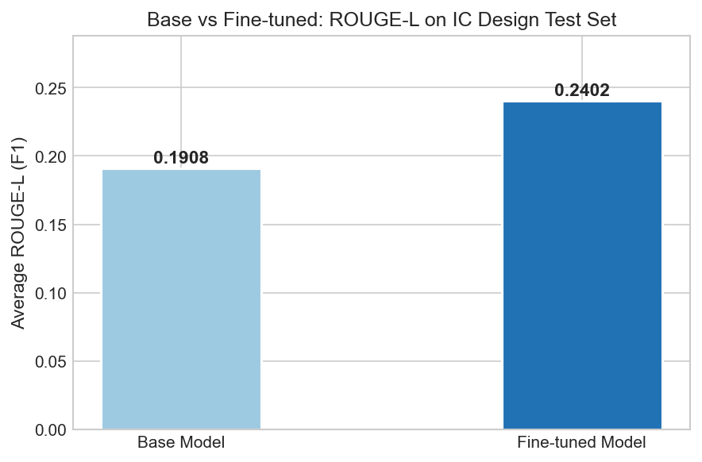

# IC Design SFT Dataset Builder

> 面向集成电路设计领域的监督微调（SFT）数据集构建pipeline，基于 Self-Instruct 方法自动生成高质量指令数据，用于垂直领域大模型微调。

---

## 项目亮点

- 🔧 **Self-Instruct pipeline**：从20条种子数据出发，自动扩展生成50k条指令数据
- 🧹 **质量过滤**：多维度过滤低质量样本，最终保留高质量子集
- 📊 **自动评估**：基于 ROUGE-L 指标对生成输出进行量化评估
- 🎯 **垂直领域**：专注集成电路设计（IC Design）专业知识

---

## 项目结构

```
ic-design-sft/
├── README.md
├── .gitignore
├── requirements.txt
├── .env.example                  # API Key 配置模板
│
├── data/
│   ├── README.md                 # 数据集说明
│   ├── sample/
│   │   └── sample_data.json      # 示例数据（10条，含output）
│   └── seeds/
│       └── seeds_20.json         # 人工种子数据（20条，无output）
│
├── scripts/
│   ├── gen_instruction.py        # Self-Instruct 指令生成
│   ├── filter.py                 # 数据质量过滤
│   ├── gen_output.py             # 生成回答输出
│   └── evaluate.py               # ROUGE-L 评估
│
├── configs/
│   └── lora_config.yaml          # LLaMA-Factory 训练配置
│
├── notebooks/
│   └── analysis.ipynb            # 数据分析与结果可视化
│
└── assets/
    ├── eval_result.json          # ROUGE-L 评估结果
    └── results.png               # 训练曲线截图
```

---

## 数据流程

```
种子数据（20条）
    ↓  gen_instruction.py
原始指令数据（50k条）
    ↓  filter.py
过滤后指令数据（~48k条高质量）
    ↓  gen_output.py
带输出的完整数据集
    ↓  evaluate.py
评估报告（ROUGE-L）
```

---

## 快速开始

### 1. 克隆项目

```bash
git clone https://github.com/your-username/ic-design-sft.git
cd ic-design-sft
```

### 2. 安装依赖

```bash
pip install -r requirements.txt
```

### 3. 配置环境变量

```bash
cp .env.example .env
# 编辑 .env，填入你的 API Key
```

### 4. 运行 pipeline

```bash
# Step 1: 生成指令数据
python scripts/gen_instruction.py

# Step 2: 过滤低质量样本
python scripts/filter.py

# Step 3: 生成回答
python scripts/gen_output.py

# Step 4: 评估质量
python scripts/evaluate.py
```

---

## 数据集说明

| 阶段 | 数据量 | 说明 |
|------|--------|------|
| 种子数据 | 20 条 | 人工精选的IC设计问答 |
| 原始生成 | 50,000 条 | Self-Instruct 自动生成 |
| 过滤后 | ~952 条 | 多维度质量过滤 |

> ⚠️ 完整数据集（50k）体积较大，未上传至 GitHub。示例数据见 `data/sample/`。

---

## 评估结果

在 IC Design 领域测试集（990条）上，微调后模型相较基座模型取得显著提升：

|指标|基座模型|微调后|提升幅度|
|---|---|---|---|
|ROUGE-L|0.1908|0.2402|**+25.9%**|

> 评估方法：ROUGE-L（中文），对比基座模型与 LoRA 微调后模型在相同测试集上的输出。  
> 完整评估数据见 [`assets/eval_result.json`](https://claude.ai/chat/assets/eval_result.json)。



---

## 技术栈

- **数据生成**：通义千问（Qwen）via DashScope API + Self-Instruct
- **模型微调**：LLaMA-Factory + LoRA
- **评估**：ROUGE-L
- **语言**：Python 3.10+

---

## 环境依赖

见 `requirements.txt`，主要依赖：

```
dashscope
rouge-chinese
tqdm
python-dotenv
```

---

## 参考资料

- [Self-Instruct Paper](https://arxiv.org/abs/2212.10560)
- [LLaMA-Factory](https://github.com/hiyouga/LLaMA-Factory)
- [Stanford Alpaca](https://github.com/tatsu-lab/stanford_alpaca)

---

## License

MIT License
